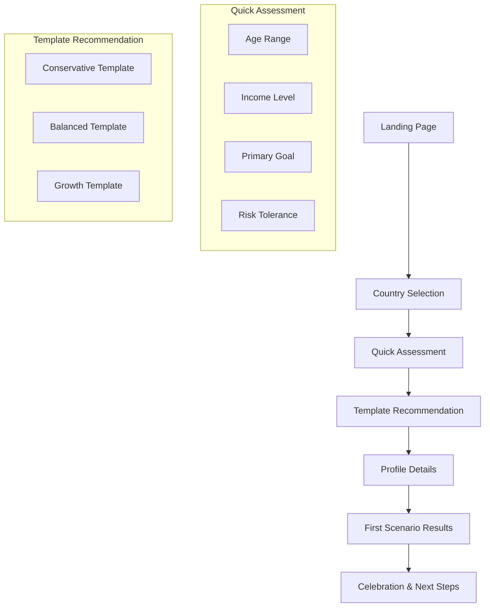
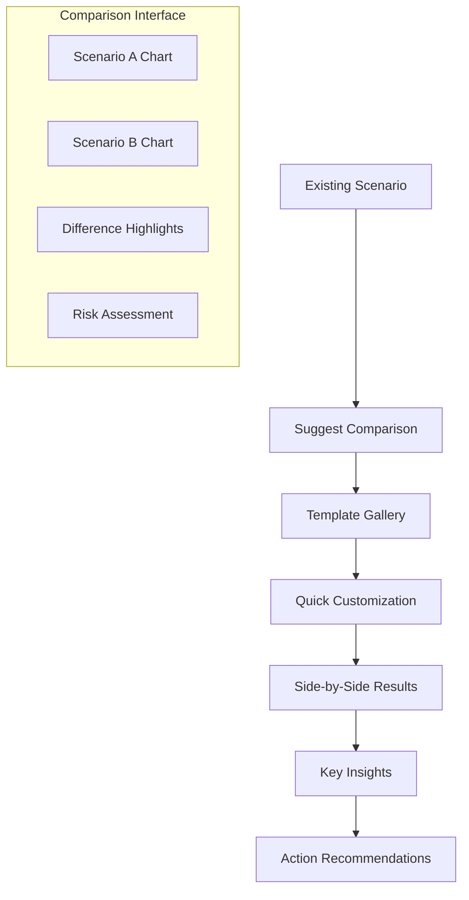
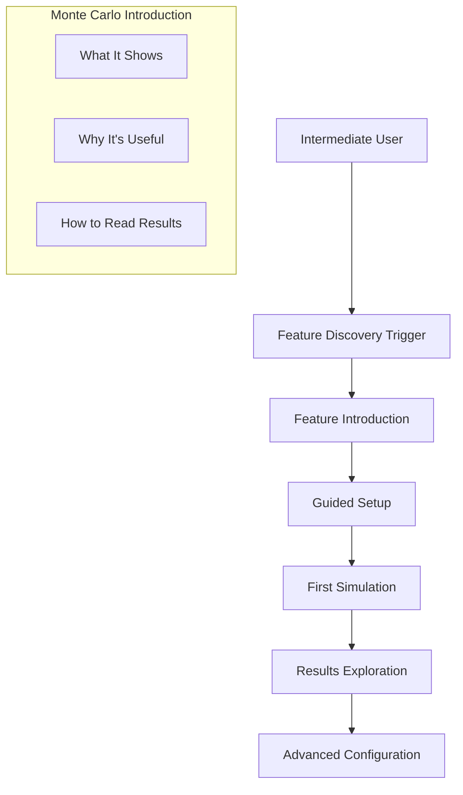

# User Experience Flows & Progression Paths

## Overview

FinPath Explorer's user experience is built around progressive complexity, guiding users from simple financial planning to sophisticated strategy optimization while maintaining an intuitive, delightful interface throughout their journey.

## Core UX Principles

### 1. **Progressive Disclosure**
- Start with essential information only
- Reveal complexity as users demonstrate readiness
- Never overwhelm, always empower

### 2. **Contextual Education**
- Explain financial concepts just-in-time
- Provide examples relevant to user's country and situation
- Link to deeper educational content when appropriate

### 3. **Immediate Feedback**
- Show calculation results as users type
- Provide visual feedback for all interactions
- Make the impact of changes immediately apparent

### 4. **Delightful Interactions**
- Smooth animations and transitions
- Tactile, responsive interface elements
- Celebrate user progress and achievements

## User Progression Journey

### Stage 1: Discovery & Setup (ELI5 Mode)

#### 1.1 First Visit Experience
```
Landing → Country Selection → Quick Assessment → First Scenario
   ↓            ↓                ↓               ↓
Beautiful    Animated         Simple          Template
homepage     flag selector    questionnaire   application
```

**User Flow Detail:**
1. **Landing Page**: Clean, trustworthy design with clear value proposition
2. **Country Selection**: Interactive map or flag selector with currency indication
3. **Quick Assessment**: 3-5 simple questions to understand user's situation
4. **Template Recommendation**: Show 2-3 personalized template options
5. **First Scenario**: One-click template application with immediate results

**Design Considerations:**
- Mobile-first design for accessibility
- Progressive loading to appear fast
- Clear privacy and security messaging
- Beautiful, trustworthy visual design

#### 1.2 Onboarding Flow
```
Profile Setup → Template Selection → First Results → "Aha!" Moment
     ↓               ↓                 ↓            ↓
Age, income,    Choose strategy    See 30-year    "I could retire
goals, etc.     template          projection     at 65!"
```

**User Flow Detail:**
1. **Profile Setup**: Smart form with intelligent defaults and validation
2. **Template Selection**: Visual cards showing strategy types with outcomes
3. **First Results**: Beautiful chart showing projected wealth growth
4. **Aha Moment**: Clear indication of retirement readiness or goal achievement

**Interaction Patterns:**
- Smart defaults reduce form friction
- Visual progress indicators
- Contextual help tooltips
- Celebration micro-animations for completed steps

### Stage 2: Exploration & Learning (Intermediate Mode)

#### 2.1 Complexity Unlock
```
Confidence Building → Feature Discovery → Template Customization → Strategy Comparison
        ↓                    ↓                   ↓                    ↓
User successfully    Show additional     Allow parameter       Side-by-side
uses ELI5 mode      features gradually  adjustments          scenario analysis
```

**Unlock Triggers:**
- User completes first scenario successfully
- User returns for second session
- User explicitly requests more control
- User demonstrates understanding through quiz/interaction

**Feature Introduction:**
- Animated feature callouts
- "Try this" suggestions
- Progressive tooltips
- Video tutorials for complex concepts

#### 2.2 Scenario Building
```
Component Addition → Parameter Tuning → Real-time Updates → Goal Tracking
       ↓                  ↓                ↓               ↓
Add investment      Adjust risk/return   See immediate    Track progress
or housing         assumptions          chart updates    toward goals
```

**User Flow Detail:**
1. **Component Addition**: Drag-and-drop or wizard-based component addition
2. **Parameter Tuning**: Sliders and inputs with real-time calculation
3. **Visual Feedback**: Charts update smoothly as parameters change
4. **Goal Tracking**: Clear progress indicators toward financial goals

### Stage 3: Mastery & Optimization (Expert Mode)

#### 3.1 Advanced Features Unlock
```
Demonstrated Expertise → Full Feature Access → Advanced Analytics → Professional Tools
         ↓                      ↓                    ↓                ↓
Complex scenarios      Monte Carlo sims     Stress testing    Report generation
successfully built     & optimizations      & scenarios       & export tools
```

**Expert Features:**
- Full parameter control
- Advanced calculations (Monte Carlo, optimization)
- Custom scenario creation
- Professional reporting tools
- API access for power users

#### 3.2 Professional Workflow
```
Strategy Design → Analysis & Testing → Optimization → Implementation Planning
      ↓               ↓                  ↓             ↓
Build complex    Run simulations     Auto-optimize   Export action
multi-component  & stress tests      allocations     plan & reports
scenarios
```

## Detailed User Flows

### Flow 1: First-Time User Onboarding

#### Entry Point: Landing Page
**Duration**: 2-3 minutes
**Goal**: User creates first scenario and sees their financial projection



**Interaction Details:**
1. **Country Selection** (30 seconds)
   - Interactive flags with hover effects
   - Currency indication changes
   - Tax system preview
   - "Your local laws will be used" messaging

2. **Quick Assessment** (60 seconds)
   - 4 simple questions with visual answers
   - Progress bar showing completion
   - Smart defaults based on country
   - Skip option for returning users

3. **Template Recommendation** (30 seconds)
   - 3 beautiful cards with outcomes
   - "People like you typically choose..." messaging
   - Preview charts showing 30-year projections
   - One-click selection

4. **Profile Details** (45 seconds)
   - Smart form with country-specific fields
   - Real-time validation and formatting
   - Intelligent suggestions (e.g., typical Super contributions)
   - "This stays private" security messaging

5. **First Results** (15 seconds)
   - Animated chart drawing
   - Key milestone callouts
   - "Aha moment" design
   - Clear next action options

### Flow 2: Scenario Comparison Journey

#### Entry Point: Existing User with Basic Scenario
**Duration**: 5-7 minutes
**Goal**: User compares multiple strategies to optimize their approach



**Interaction Details:**
1. **Suggest Comparison** (Smart Trigger)
   - "People with similar goals also consider..."
   - Non-intrusive suggestion banner
   - Show potential improvement preview
   - One-click to start comparison

2. **Template Gallery** (60 seconds)
   - Filtered templates based on user profile
   - Quick preview of each strategy
   - "Similar to your current" indicators
   - Custom scenario creation option

3. **Quick Customization** (90 seconds)
   - Simplified parameter adjustment
   - Real-time calculation previews
   - Smart suggestions for improvements
   - "Good starting point" confirmation

4. **Side-by-Side Results** (120 seconds)
   - Beautiful comparison visualization
   - Animated transitions between views
   - Key difference highlights
   - Risk vs. return positioning

5. **Key Insights** (60 seconds)
   - AI-generated insights about differences
   - Risk assessment comparison
   - Timeline to goals
   - Probability of success indicators

### Flow 3: Expert Feature Discovery

#### Entry Point: Intermediate User Ready for Advanced Features
**Duration**: 8-10 minutes
**Goal**: User discovers and uses Monte Carlo simulation



**Interaction Details:**
1. **Feature Discovery Trigger**
   - User demonstrates readiness (complex scenarios, multiple returns)
   - Contextual prompt: "Want to see probability of success?"
   - Beautiful feature preview animation
   - Educational value proposition

2. **Feature Introduction** (90 seconds)
   - Animated explanation of Monte Carlo concepts
   - Real examples: "Instead of assuming 7% returns every year..."
   - Visual demonstration with simple charts
   - "Try it now" call-to-action

3. **Guided Setup** (120 seconds)
   - Pre-filled with intelligent defaults
   - Explanation of each parameter
   - "Most people use these settings" guidance
   - Progressive disclosure of advanced options

4. **First Simulation** (45 seconds)
   - Beautiful progress animation
   - Real-time updates as calculation progresses
   - Anticipation building with status messages
   - Celebration of completion

5. **Results Exploration** (180 seconds)
   - Interactive fan chart with explanations
   - Hover tooltips for probability bands
   - Key metrics highlighted
   - "What this means" plain English explanations

## Mobile-First Design Patterns

### Touch-Friendly Interactions
- **Slider Controls**: Large touch targets with haptic feedback
- **Card Interactions**: Swipe gestures for scenario browsing
- **Chart Navigation**: Pinch-to-zoom and pan for detailed exploration
- **Quick Actions**: Floating action buttons for common tasks

### Progressive Enhancement
- **Core Functionality**: Works perfectly on basic mobile browsers
- **Enhanced Features**: Advanced animations on capable devices
- **Adaptive UI**: Adjusts complexity based on screen size and capabilities
- **Offline Support**: Basic calculations work without internet

### Performance Optimization
- **Lazy Loading**: Charts and complex components load on demand
- **Image Optimization**: Responsive images with appropriate formats
- **Animation Performance**: 60fps animations with hardware acceleration
- **Battery Awareness**: Reduce calculations on low battery devices

## Accessibility & Inclusivity

### Universal Design
- **Screen Reader Support**: Full ARIA labels and keyboard navigation
- **Color Accessibility**: High contrast mode and colorblind-friendly palettes
- **Motor Accessibility**: Large touch targets and alternative input methods
- **Cognitive Accessibility**: Clear language and logical information hierarchy

### Language & Localization
- **Plain English**: Financial concepts explained simply
- **Cultural Sensitivity**: Examples relevant to each country's context
- **Currency Formatting**: Local currency symbols and formatting
- **Date Formats**: Country-appropriate date and number formats

### Financial Literacy Support
- **Contextual Education**: Just-in-time explanations of financial concepts
- **Glossary Integration**: Hover definitions for technical terms
- **Progress Tracking**: Users can see their financial knowledge growing
- **Expert Mode Graduation**: Clear path from beginner to sophisticated user

## Emotional Design Elements

### Trust Building
- **Security Indicators**: Clear privacy and data protection messaging
- **Professional Design**: Clean, trustworthy visual aesthetic
- **Transparent Calculations**: "Show me how this was calculated" options
- **Third-Party Validation**: Professional review badges where appropriate

### Motivation & Engagement
- **Progress Celebrations**: Milestone achievements and progress recognition
- **Goal Visualization**: Clear progress toward financial goals
- **Success Stories**: Contextual examples of goal achievement
- **Gentle Encouragement**: Positive messaging for small improvements

### Confidence Building
- **Smart Defaults**: Intelligent starting points reduce decision paralysis
- **Guided Exploration**: Gentle suggestions for next steps
- **Undo/Reset Options**: Safe exploration without fear of breaking things
- **Expert Validation**: "This looks like a solid strategy" confirmations

## Continuous Improvement Framework

### User Feedback Integration
- **In-App Feedback**: Contextual feedback prompts at key moments
- **Usage Analytics**: Heat maps and interaction tracking
- **A/B Testing**: Continuous optimization of flows and interfaces
- **User Research**: Regular interviews with users at different progression stages

### Adaptive Interface
- **Learning from Usage**: Interface adapts to user's demonstrated sophistication
- **Personalized Recommendations**: Suggestions based on user's specific situation
- **Dynamic Complexity**: Automatically adjust complexity based on user success
- **Custom Workflows**: Power users can create custom workflow shortcuts

This comprehensive UX framework ensures FinPath Explorer delivers on its promise of being both stunning and easy to use, while supporting users' growth from financial planning novices to sophisticated strategists.